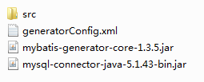
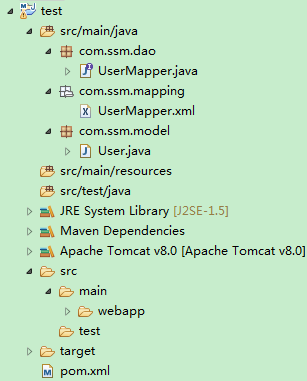

## 使用MyBatis Generator自动创建代码


### 创建目录


在*不含中文和空格* 的任意目录下新建一个文件夹；再在该文件夹下新建src文件夹，用来存放生成的代码文件。





### generatorConfig.xml

```javascript

<?xml version="1.0" encoding="UTF-8"?>
<!DOCTYPE generatorConfiguration
PUBLIC "-//mybatis.org//DTD MyBatis Generator Configuration 1.0//EN"
"http://mybatis.org/dtd/mybatis-generator-config_1_0.dtd">
<generatorConfiguration>

    <classPathEntry location="mysql-connector-java-5.1.43-bin.jar" />
	
    <context id="DB2Tables" targetRuntime="MyBatis3">
        <commentGenerator>
            <property name="suppressDate" value="true" />
            <property name="suppressAllComments" value="true" />
        </commentGenerator>
		
        <!-- 
			配置数据库连接
			driverClass: 数据库驱动
			connectionURL: 数据库连接串
			userId: 登录数据库的用户名
			password: 登录数据库的密码
		-->
        <jdbcConnection driverClass="com.mysql.jdbc.Driver"
            connectionURL="jdbc:mysql://192.168.8.128:3306/shiro" 
			userId="root"
            password="root">
        </jdbcConnection>
		
        <javaTypeResolver>
            <property name="forceBigDecimals" value="false" />
        </javaTypeResolver>
		
        <!-- 
			生成实体类
			targetPackage: 包名
			targetProject: Package所在的目标位置
		-->
        <javaModelGenerator targetPackage="com.ssm.model"
            targetProject="src">
            <property name="enableSubPackages" value="true" />
            <property name="trimStrings" value="true" />
        </javaModelGenerator>
		
        <!-- 
			生成映射文件
			targetPackage: 包名
			targetProject: Package所在的目标位置
		-->
        <sqlMapGenerator targetPackage="com.ssm.mapping"
            targetProject="src">
            <property name="enableSubPackages" value="true" />
        </sqlMapGenerator>
		
        <!-- 
			生成DAO接口
			targetPackage: 包名
			targetProject: Package所在的目标位置
		-->
        <javaClientGenerator type="XMLMAPPER"
            targetPackage="com.ssm.dao" targetProject="src">
            <property name="enableSubPackages" value="true" />
        </javaClientGenerator>
		
        <!-- 
			把数据表生成实体类
			tableName: 表名或视图名 
			domainObjectName: 实体类的名称 
		-->
        <table tableName="users" domainObjectName="User"
            enableCountByExample="false" enableUpdateByExample="false"
            enableDeleteByExample="false" enableSelectByExample="false"
            selectByExampleQueryId="false">
		</table>
    </context>
</generatorConfiguration>

```

### cmd

~~~javascript

java -jar mybatis-generator-core-1.3.5.jar -configfile generatorConfig.xml -overwrite

~~~

**注意cmd的输出信息：**

- **MyBatis Generator finished successfully.**

表示生成成功。


- **前言中不允许有内容**

原因：把xml文件编码转为UTF-8时会有一个BOM头，所以java在读取时就会报以上错误。

解决方法：用notepad++打开xml文件，选择*以UTF-8无BOM格式编码*，然后保存。


### 生成的代码结构

